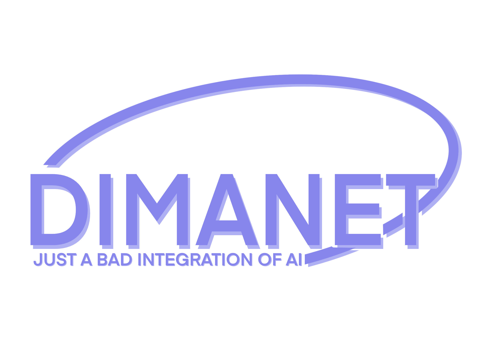

# DimaNet



DimaNet is a small neural network library written in C11. It is a fork of
[GENANN](http://codeplea.com/genann). The whole thing is two files:
`dimanet.c` and `dimanet.h`. No dependencies, just a C compiler and `libm`.

## Features

- Feedforward networks with any number of hidden layers
- Activation functions: sigmoid, tanh, ReLU, leaky ReLU, ELU, Softplus, SiLU,
  GELU and more
- Initializers: uniform, normal, Xavier, He, LeCun
- Backpropagation with optional momentum and gradient clipping
- Seeded randomness so runs are reproducible
- Save and load networks as text files

## Build

With make:

    make            # builds libdimanet.a and libdimanet.so in build/
    make test       # runs the test suite
    make examples   # builds the examples in build/
    make install    # installs to /usr/local

With cmake:

    cmake -B build
    cmake --build build
    ctest --test-dir build

## Quick start

```c
#include "dimanet.h"

int main(void) {
    dimanet_seed(1);

    /* 2 inputs, 1 hidden layer with 3 neurons, 1 output. */
    dimanet *ann = dimanet_init(2, 1, 3, 1);

    const double input[2] = {0.0, 1.0};
    const double target[1] = {1.0};

    dimanet_train(ann, input, target, 0.1);
    printf("%f\n", dimanet_run(ann, input)[0]);

    dimanet_free(ann);
    return 0;
}
```

Compile with `cc example.c dimanet.c -lm`.

## Examples

The `examples/` directory has five programs, including XOR learning and the
IRIS classifier. See [examples/README.md](examples/README.md).

## License

GPL-3.0. Derived from GENANN (MIT), copyright (c) 2015-2016 Lewis Van Winkle.
